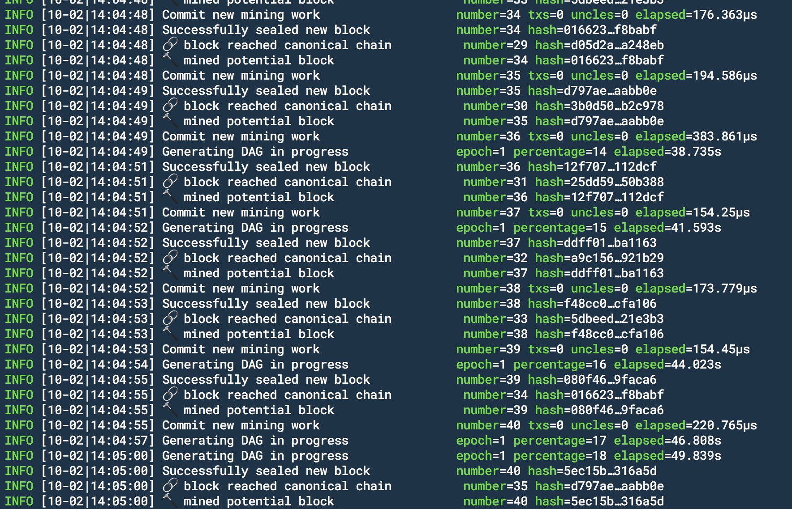
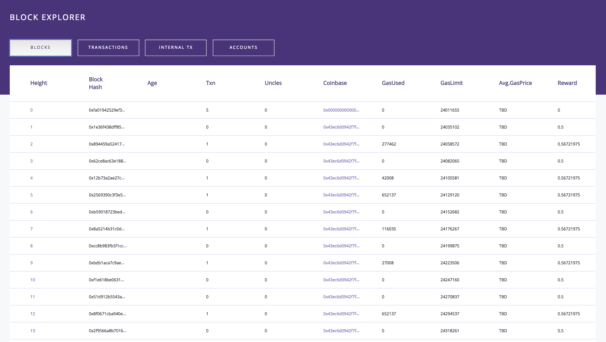

# Introduction

### A Note From The Developers

Our goal was to avoid compromising the integrity of Geth and simply extend existing functionality to meet the specific needs of the Shyft Network. To our utmost ability we have documented, within the codebase, exactly where we have extended our functionality using the following notation:  NOTE:SHYFT. This document is meant to provide a high level overview of the changes made to Geth and to provide explanations, where needed, on the changes that were made. Another benefit of this document is to allow others to quickly see the changes that were made in order to get quicker feedback on a compromising line of code.

### Contributing To Shyft Geth

In order to successfully accept a PR the maintainers of the Shyft repositories require that this document must be updated, reflecting the changes made in the PR. Along with the documentation, we ask that contributors provide the NOTE:SHYFT. The tag could should contain a brief on the modified code. This will help with releases further down the road as we document what breaking changes have been made along the journey.

#### Linting
In order to successfully have a PR merged into go-empyrean your changes need to pass our TravisCI that runs every PR. One of the builds in Travis tests that you've properly linted your code.
The linter we are using is `gometalinter` from the following [repo.](https://github.com/alecthomas/gometalinter) The TravisCI runs the below commands:

> Gometalinter commands
```
gometalinter ./... --vendor --tests --deadline=2m --disable-all --enable=goimports --enable=varcheck --enable=vet --enable=gofmt --enable=misspell --exclude=core/genesis.go --exclude=eth/handler_test.go --exclude=eth/downloader/api.go --enable=goconst --min-occurrences=6
gometalinter --vendor --tests --deadline=10m --disable-all --exclude=ethdb/shyft_database.go --enable=gosimple ./...
gometalinter --vendor --tests --deadline=10m --disable-all --enable=unconvert ./...
```
The above commands will indicate which files need to be properly linted. Often its as simple as running the below command:

`gofmt -w <filename>`

`goimports -w <filename>`

However, sometimes you need to simplify parts of your code, for example:
```
A range of the form:
	for _ = range v {...}
will be simplified to:
	for range v {...}
``` 

Learn more through the official godocs [here.](https://golang.org/cmd/gofmt/)

# Setup

### Dependencies
    
 - go 1.10
 - postgres 10
    
To install go please review the installation docs [here](https://golang.org/doc/install), but ensure you download version 1.10. If you would like to install go with a script please check out this repo [here](https://github.com/canha/golang-tools-install-script).
    
To install postgres please review the installation docs [here](https://www.postgresql.org/docs/10/static/tutorial-install.html).

To run postgres locally on Ubuntu/Debian follow the below steps:

  - Install postgres [here](https://www.postgresql.org/docs/10/static/tutorial-install.html)
  - `sudo apt update`
  - `sudo apt install postgresql`

### Govendor and Packages/Dependencies

> Download Go Vendor

```shell
go get -u github.com/kardianos/govendor
```

> To run govendor globally, have this in your bash_profile file:

```shell
export GOPATH=$HOME/go
export PATH=$PATH:$HOME/go/bin
```

> Then go_empyrean will need to be cloned to this directory:

```shell
$GOPATH/src/github.com/ShyftNetwork/
```

Geth uses govendor to manage packages/dependencies: [Go Vendor](https://github.com/kardianos/govendor)

This has some more information: [Ethereum Wiki](https://github.com/ShyftNetwork/go-empyrean/wiki/Developers'-Guide)

To add a new dependency, run govendor fetch <import-path> , and commit the changes to git. Then the deps will be accessible on other machines that pull from git.

<aside class="notice">
GOPATH is not strictly necessary however, for govendor it is much easier to use gopath as go will look for binaries in this directory ($GOPATH/bin). To set up GOPATH, read the govendor section.
</aside>

### Running Locally

To begin running locally, please ensure you have correctly installed go 1.10 and postgres (make sure postgres is running). 
Once cloned, in a terminal window run the following command:

Before running any CLI options ensure you run **`make geth`** in the root directory.

``.shyft-geth.sh --setup`` This sets up postgres and the shyft chain db

``./shyft-geth.sh --start`` This starts GETH

At this point you should see GETH running in the terminal and if you opened your postgres instance you should see data being populated into the tables. It might look something similiar to the image below.



To stop Geth, **`crtl+C`** in the terminal window, if you proceed with the start script mentioned above the Shyft chain will begin from the last block height, if you wish to start the chain fresh from genesis follow the below steps:

``./shyft-geth.sh --reset`` This drops postgres and chaindb data

``./shyft-geth.sh --start`` Starts GETH

If you wish to run ShyftGeth without a postgres instance please follow the below steps:

 - `cd ./shyft-cli`
 - Open `initShyftGeth.sh`
 - Add `--disablepg` flag to both the if and else statement, typically in front of the `--keystore` flag
 - Open `startShyftGeth.sh`
 - Add `--disablepg` flag to both the if and else statement, typically after the `--ws` flag
 
If you've followed the steps above your `initShyftGeth.sh` and `startShyftGeth.sh` should look similiar as below:

```shell
#!/bin/sh
 if [ -z "${DBENV}" ]; then
   ./build/bin/geth --identity "ShyftTestnetNode" --disablepg --keystore ./ --datadir "./shyftData" init ./ShyftNetwork.json
 else
   if [ -d /go/src/ShyftNetwork/go-empyrean/shyftData/geth/chaindata ]; then
     echo "Skipping Genesis Initialization as already completed"
     :
   else
     echo "Initializing Custom Genesis Block"
     /bin/geth --identity "ShyftTestnetNode" --disablepg --keystore ./ --datadir "./shyftData" init ShyftNetwork.json
   fi
 fi
```

```
#!/bin/sh
if [ -z "${DBENV}" ]; then
  ./build/bin/geth --config config.toml --ws --disablepg --wsaddr="0.0.0.0" --wsorigins "*" --nat=any --mine --minerthreads 4 --targetgaslimit 80000000 --unlock "0x43EC6d0942f7fAeF069F7F63D0384a27f529B062,0x9e602164C5826ebb5A6B68E4AFD9Cd466043dc4A,0x5Bd738164C61FB50eb12E227846CbaeF2dE965Aa,0xC04eE4131895F1d0C294D508AF65D94060AA42BB,0x07D899C4aC0c1725C35C5f816e60273B33a964F7" --password ./unlockPasswords.txt
else
  /bin/geth --config config.toml --gcmode archive --ws --disablepg --wsaddr="0.0.0.0" --wsorigins "*" --nat=any --mine --minerthreads 4 --targetgaslimit 80000000 --unlock "0x43EC6d0942f7fAeF069F7F63D0384a27f529B062,0x9e602164C5826ebb5A6B68E4AFD9Cd466043dc4A,0x5Bd738164C61FB50eb12E227846CbaeF2dE965Aa,0xC04eE4131895F1d0C294D508AF65D94060AA42BB,0x07D899C4aC0c1725C35C5f816e60273B33a964F7" --password ./unlockPasswords.txt
fi
```

<aside class="warning">
The above instructions will NOT initialize a postgres instance and will not write data to the postgres instance and thus the API and block explorer UI will not be able to run properly.
</aside>


If you are installing postgresql locally for development on Ubuntu the app assumes that no password is set for the postgresql user and that the development user is provided with superuser privildges 
  - if this is not the case you will need to modify the variable `connStrDefault` in `core/db.go` accordingly. Documentation on how to set up a development user are available [here](https://www.postgresql.org/docs/10/static/app-createuser.html)
  
  `sudo -i -u postgres`
  
  `creatuser <dev-user> --superuser`

To see transactions being submitted on the network see the sendTransactions command in the CLI section of this readme.
### Docker Images
Two sets of Docker Images are available for ShyftGeth, the Postgresql Database, and the Shyft Blockchain Explorer, which can be used for local development and testnet connection. The development settings are included in docker-compose.yml, the testnet settings are included in docker-compose.production.yml (shyftgeth not mining by default). To launch these containers you will need to have docker-compose installed on your computer. Installation instructions for docker-compose are available [here](https://docs.docker.com/install/).

**To build the images for the first time please run the following command:**

`./shyft-geth.sh --setup # clears persisted directories prior to docker build`

`docker-compose up --build`

If you would like to reinitialize/rebuild the docker images you can run the above mentioned command as well.

To launch ShyftGeth, PG, the ShyftBlock Explorer Api and UI anytime after initial build - issue the following commands from the root of the project directory:

`./shyft-geth.sh --setup # clears persisted directories prior to docker build`

**`docker-compose up`**

To stop/pause mining - enter:

**`docker-compose stop`**

And then just issue `docker-compose up` to continue mining.
### Docker Postgresql - DB Connection
From your local machine you can view the database by connecting to the database in the container at 
**``127.0.0.1:8001``**

Use the following credentials: 
 
 ``User: 'postgres'``
 
 ``Password: 'docker'``
  
 ``Database: 'shyftdb'``
    
### Docker Block Explorer Api 
To access the shyftBlockExplorer open a browser and visit 

**``http://localhost:3000``**

To rebuild any one of the services- issue the following commands:

Services:

   - go-empyrean_shyftgeth
   - go-empyrean_pg
   - go-empyrean_shyft_block_api
   - go-empyrean_shyft_block_ui

**``
docker-compose up -d --no-deps --build <docker compose file service name> 
``**

ie. for shyftBlockExplorerApi:

**``docker-compose up -d --no-deps --build shyft_block_api``**

The Postgresql Database Container will persist the database data to the directory ``./pg-data`` _. So if you do want to reinitialize the database you should delete this directory as well as the blockchain data directories ``(./shyftData ./privatenet)`` prior to launching the docker containers. There is a shell script available to delete these folders to run it execute the following command:

**``./shyft-cli/resetShyftGeth.sh``**

Blockchain data is persisted to **``./ethash/.ethash and ./shyftData__``**. If you would like to reset the test blockchain you will need to delete the **``__./ethash ./shyftData & ./privatenet__``** directories.

The docker container for the ShyftBlockExplorerApi utilizes govendor to minimize its image size. **If you would like the docker image for this container to reflect any uncommitted changes which may have occurred in the go-empyrean repository, ie. changes with respect to go-empyrean core (ie. cryptographic functions and database). Prior to launching the docker containers you should rebuild the vendor directory for the shyftBlockExplorerApi - by executing the following steps:**

Remove existing shyftBlockExplorerApi vendor.json and vendored components:

**``rm -rf shyftBlockExplorerApi/vendor``**

reinitialize vendor.json

**``cd shyftBlockExplorerApi && govendor init``**

rebuild vendor.json using latest uncommitted changes

**``govendor add +external``**

Due to a bug in govendor and it not being able to pull in some dependencies that are c-header files 
you should execute the following commands - see these issues - which whilst closed
appears to have not been fixed: https://github.com/kardianos/govendor/issues/124 && https://github.com/kardianos/govendor/issues/61

**``govendor remove github.com/ShyftNetwork/go-empyrean/crypto/secp256k1/^``**

**``govendor fetch github.com/ShyftNetwork/go-empyrean/crypto/secp256k1/^``**

### Connecting to the Geth Console from Docker

If you wish to connect to the Geth console while running in docker use the below command:

**`sudo docker exec -it eedd geth attach http://localhost:8545`**

<aside class="warning">
The Shyft Geth docker image size is 1+ GB so make sure you have adequate space on your disk drive
</aside>

### Docker Port TroubleShooting

Stop/remove all docker containers that may be using conflicting ports - ports for each of the containers shown in the ``docker-compose.yml``

To see which ports are being used on your machine you can run the below command in your terminals root directory:

``netstat -a``


# Shyft BlockExplorer API

In order to store the block explorer database, a custom folder was created `./shyft_schema` that contains the schema for the explorer database.

The main functions exist in `./core/shyft_database_util.go` and `./core/shyft_get_utils.go`

To run the block explorer rest api that queries the postgres instance and returns a json body, open a new terminal window, navigate to the root directory of the project and run the following command:

**``go run blockExplorerApi/*.go``**

<aside class="warning">
The above command is to only be used if running locally and assumes that the block explorer API is being run from the same server.
</aside>

This will start a go server on port 8080 and allow you to either run the pre-existing block explorer or query the api endpoints. Its important to note, that if you have nothing in your postgres database the API will return nothing.

## Blocks

<span style="color:#fff; height: 25px; width: 30px; background: blue; padding: 7px; margin-right: 5px;">**GET**</span> ``/api/get_block/{blockNumber}`` 

<span style="color:#fff; height: 25px; width: 30px; background: red; padding: 7px; margin-right: 5px;">**Headers**</span> ``Content-Type: application/json``

**Description**

```json
{  
   "Hash":"0x72590ac6e7626b9b1f77452d83297c0361e6ff7fa011872289224ee02b9acc8f",
   "Coinbase":"0x43ec6d0942f7faef069f7f63d0384a27f529b062",
   "Age":"2018-10-01T11:15:54Z",
   "ParentHash":"0x5c1aa0559093d9e1e128b6d8ae63d5bf9a5fbf273f704afad9adac88e734c3cc",
   "UncleHash":"0x1dcc4de8dec75d7aab85b567b6ccd41ad312451b948a7413f0a142fd40d49347",
   "Difficulty":"135005",
   "Size":"538.00 B",
   "Rewards":"5000000000000000000",
   "Number":63,
   "GasUsed":0,
   "GasLimit":25534458,
   "Nonce":7333650700872754740,
   "TxCount":0,
   "UncleCount":0
}
```

The above endpoint will respond with the block data for that specific block number. The table below lists the attributes that will be included in the response from this endpoint.

| Parameter | Description |
| --- | --- |
| `blockNumber` | The block height or block number |

| Attributes | Description                                  |    Type  |
| :---       |     :---:                                    |    ---:  |
| `Hash`     | Block hash                                   | string   |
| `Coinbase` | Address of miner                             | string   |
| `Number`   | Block height                                 | number   |
| `GasUsed`  | Amount of gas used                           | number   |
| `GasLimit` | Maximum amount of gas willing to be spent    | number   |
| `TxCount`  | Amount of transactions included in the block | number   |
| `UncleCount`| Amount of uncle blocks                      | number   |
| `Age`       | Time stamp of block creation                | Timestamp|
| `ParentHash`| Hash of the prior block                     | string   |
| `UncleHash` | Hash of a the uncle block                   | string   |
| `Size`      | Size of block measured in Bytes             | string   |
| `Rewards`   | Block reward                                | string   |
| `Nonce`     | Value used for PoW                          | number   |
| `Difficulty`| The difficulty for this block               | string   |


<span style="color:#fff; height: 25px; width: 30px; background: blue; padding: 7px; margin-right: 5px;">**GET**</span> ``/api/get_all_blocks`` 

<span style="color:#fff; height: 25px; width: 30px; background: red; padding: 7px; margin-right: 5px;">**Headers**</span> ``Content-Type: application/json``

**Description**

```json
[{  
   "Hash":"0x5c1aa0559093d9e1e128b6d8ae63d5bf9a5fbf273f704afad9adac88e734c3cc",
   "Coinbase":"0x43ec6d0942f7faef069f7f63d0384a27f529b062",
   "Age":"2018-10-01T11:15:53Z",
   "ParentHash":"0xb0437e25e7cfb113bbea0f014883e8f441d5465bb628f9a112eb372e43055f1a",
   "UncleHash":"0x1dcc4de8dec75d7aab85b567b6ccd41ad312451b948a7413f0a142fd40d49347",
   "Difficulty":"134940",
   "Size":"538.00 B",
   "Rewards":"5000000000000000000",
   "Number":62,
   "GasUsed":0,
   "GasLimit":25509548,
   "Nonce":2307164919004664188,
   "TxCount":0,
   "UncleCount":0
},
{  
   "Hash":"0x72590ac6e7626b9b1f77452d83297c0361e6ff7fa011872289224ee02b9acc8f",
   "Coinbase":"0x43ec6d0942f7faef069f7f63d0384a27f529b062",
   "Age":"2018-10-01T11:15:54Z",
   "ParentHash":"0x5c1aa0559093d9e1e128b6d8ae63d5bf9a5fbf273f704afad9adac88e734c3cc",
   "UncleHash":"0x1dcc4de8dec75d7aab85b567b6ccd41ad312451b948a7413f0a142fd40d49347",
   "Difficulty":"135005",
   "Size":"538.00 B",
   "Rewards":"5000000000000000000",
   "Number":63,
   "GasUsed":0,
   "GasLimit":25534458,
   "Nonce":7333650700872754740,
   "TxCount":0,
   "UncleCount":0
}]
```

The above endpoint will respond with the block data for all blocks in the postgres db. The table below lists the attributes that will be included in the response from this endpoint.

*No Parameter requirement*

| Attributes | Description                                  |    Type  |
| :---       |     :---:                                    |    ---:  |
| `Hash`     | Block hash                                   | string   |
| `Coinbase` | Address of miner                             | string   |
| `Number`   | Block height                                 | number   |
| `GasUsed`  | Amount of gas used                           | number   |
| `GasLimit` | Maximum amount of gas willing to be spent    | number   |
| `TxCount`  | Amount of transactions included in the block | number   |
| `UncleCount`| Amount of uncle blocks                      | number   |
| `Age`       | Time stamp of block creation                | Timestamp|
| `ParentHash`| Hash of the prior block                     | string   |
| `UncleHash` | Hash of a the uncle block                   | string   |
| `Size`      | Size of block measured in Bytes             | string   |
| `Rewards`   | Block reward                                | string   |
| `Nonce`     | Value used for PoW                          | number   |
| `Difficulty`| The difficulty for this block               | string   |


<span style="color:#fff; height: 25px; width: 30px; background: blue; padding: 7px; margin-right: 5px;">**GET**</span> ``/api/get_recent_block`` 

<span style="color:#fff; height: 25px; width: 30px; background: red; padding: 7px; margin-right: 5px;">**Headers**</span> ``Content-Type: application/json``

**Description**

```json
{  
   "Hash":"0x72590ac6e7626b9b1f77452d83297c0361e6ff7fa011872289224ee02b9acc8f",
   "Coinbase":"0x43ec6d0942f7faef069f7f63d0384a27f529b062",
   "Age":"2018-10-01T11:15:54Z",
   "ParentHash":"0x5c1aa0559093d9e1e128b6d8ae63d5bf9a5fbf273f704afad9adac88e734c3cc",
   "UncleHash":"0x1dcc4de8dec75d7aab85b567b6ccd41ad312451b948a7413f0a142fd40d49347",
   "Difficulty":"135005",
   "Size":"538.00 B",
   "Rewards":"5000000000000000000",
   "Number":63,
   "GasUsed":0,
   "GasLimit":25534458,
   "Nonce":7333650700872754740,
   "TxCount":0,
   "UncleCount":0
}
```

The above endpoint will respond with the block data from the highest block height. The table below lists the attributes that will be included in the response from this endpoint.

*No Parameter requirement*

| Attributes | Description                                  |    Type  |
| :---       |     :---:                                    |    ---:  |
| `Hash`     | Block hash                                   | string   |
| `Coinbase` | Address of miner                             | string   |
| `Number`   | Block height                                 | number   |
| `GasUsed`  | Amount of gas used                           | number   |
| `GasLimit` | Maximum amount of gas willing to be spent    | number   |
| `TxCount`  | Amount of transactions included in the block | number   |
| `UncleCount`| Amount of uncle blocks                      | number   |
| `Age`       | Time stamp of block creation                | Timestamp|
| `ParentHash`| Hash of the prior block                     | string   |
| `UncleHash` | Hash of a the uncle block                   | string   |
| `Size`      | Size of block measured in Bytes             | string   |
| `Rewards`   | Block reward                                | string   |
| `Nonce`     | Value used for PoW                          | number   |
| `Difficulty`| The difficulty for this block               | string   |


<span style="color:#fff; height: 25px; width: 30px; background: blue; padding: 7px; margin-right: 5px;">**GET**</span> ``/api/get_blocks_mined/{coinbase}`` 

<span style="color:#fff; height: 25px; width: 30px; background: red; padding: 7px; margin-right: 5px;">**Headers**</span> ``Content-Type: application/json``

**Description**

```json
[{  
   "Hash":"0x5c1aa0559093d9e1e128b6d8ae63d5bf9a5fbf273f704afad9adac88e734c3cc",
   "Coinbase":"0x43ec6d0942f7faef069f7f63d0384a27f529b062",
   "Age":"2018-10-01T11:15:53Z",
   "ParentHash":"0xb0437e25e7cfb113bbea0f014883e8f441d5465bb628f9a112eb372e43055f1a",
   "UncleHash":"0x1dcc4de8dec75d7aab85b567b6ccd41ad312451b948a7413f0a142fd40d49347",
   "Difficulty":"134940",
   "Size":"538.00 B",
   "Rewards":"5000000000000000000",
   "Number":62,
   "GasUsed":0,
   "GasLimit":25509548,
   "Nonce":2307164919004664188,
   "TxCount":0,
   "UncleCount":0
},
{  
   "Hash":"0x72590ac6e7626b9b1f77452d83297c0361e6ff7fa011872289224ee02b9acc8f",
   "Coinbase":"0x43ec6d0942f7faef069f7f63d0384a27f529b062",
   "Age":"2018-10-01T11:15:54Z",
   "ParentHash":"0x5c1aa0559093d9e1e128b6d8ae63d5bf9a5fbf273f704afad9adac88e734c3cc",
   "UncleHash":"0x1dcc4de8dec75d7aab85b567b6ccd41ad312451b948a7413f0a142fd40d49347",
   "Difficulty":"135005",
   "Size":"538.00 B",
   "Rewards":"5000000000000000000",
   "Number":63,
   "GasUsed":0,
   "GasLimit":25534458,
   "Nonce":7333650700872754740,
   "TxCount":0,
   "UncleCount":0
}]
```

The above endpoint will respond with the block data for all blocks which have been mined by the provided address. The table below lists the attributes that will be included in the response from this endpoint.

| Parameter | Description |
| --- | --- |
| `coinbase` | The miners address |

| Attributes | Description                                  |    Type  |
| :---       |     :---:                                    |    ---:  |
| `Hash`     | Block hash                                   | string   |
| `Coinbase` | Address of miner                             | string   |
| `Number`   | Block height                                 | number   |
| `GasUsed`  | Amount of gas used                           | number   |
| `GasLimit` | Maximum amount of gas willing to be spent    | number   |
| `TxCount`  | Amount of transactions included in the block | number   |
| `UncleCount`| Amount of uncle blocks                      | number   |
| `Age`       | Time stamp of block creation                | Timestamp|
| `ParentHash`| Hash of the prior block                     | string   |
| `UncleHash` | Hash of a the uncle block                   | string   |
| `Size`      | Size of block measured in Bytes             | string   |
| `Rewards`   | Block reward                                | string   |
| `Nonce`     | Value used for PoW                          | number   |
| `Difficulty`| The difficulty for this block               | string   |


## Transactions

<span style="color:#fff; height: 25px; width: 30px; background: blue; padding: 7px; margin-right: 5px;">**GET**</span> ``/api/get_transaction/{txHash}`` 

<span style="color:#fff; height: 25px; width: 30px; background: red; padding: 7px; margin-right: 5px;">**Headers**</span> ``Content-Type: application/json``

**Description**

```json
{  
   "TxHash":"0x5bd738164c61fb50eb12e227846cbaef2de965aa0x5bd738164c61fb50eb12e227846cbaef2de965aa",
   "To":"0x5bd738164c61fb50eb12e227846cbaef2de965aa",
   "From":"0x007622d84a234bb8b078230fcf84b67ae9a8acae",
   "BlockHash":"0xfa01942529ef3a4e543ef8c061c6e0cb69a61c489d3bb6891bb65651c02dafd4",
   "BlockNumber":"2",
   "Amount":"400000000000000000000",
   "GasPrice":1253,
   "Gas":12124,
   "GasLimit":24011655,
   "Cost":"53002",
   "Nonce":2,
   "Status":"SUCCESS",
   "IsContract":false,
   "Age":"2018-03-18T19:38:41Z",
   "Data":""
}
```

The above endpoint will respond with transaction data from the provided transaction hash. The table below lists the attributes that will be included in the response from this endpoint.

| Parameter | Description |
| --- | --- |
| `txHash` | The hash for that particular transaction |

| Attributes  | Description                                     |    Type  |
| :---        |     :---:                                       |    ---:  |
| `TxHash`    | Transaction hash                                | string   |
| `To`        | Address of transaction receiver                 | string   |
| `From`      | Address of transaction sender                   | string   |
| `BlockHash` | Hash of block                                   | string   |
| `BlockNumber`| Block height                                   | string   |
| `Amount`    | Amount of value being transferred               | string   |
| `GasPrice`  | Price of required gas                           | number   |
| `Gas`       | Required pricing value to process transaction   | number   |
| `GasLimit`  | Maximum amount of gas willing to be spent       | number   |
| `Cost`      | Hash of a the uncle block                       | string   |
| `Nonce`     | Number of transactions sent from a given address| number   |
| `Status`    | Whether the transaction was success or fail     | string   |
| `IsContract`| Whether the transaction was from a contract     | bool     |
| `Age`       | Time stamp of transaction creation              | timestamp|
| `Data`      | Contract data in byte code                      | byteArray|


<span style="color:#fff; height: 25px; width: 30px; background: blue; padding: 7px; margin-right: 5px;">**GET**</span> ``/api/get_all_transactions`` 

<span style="color:#fff; height: 25px; width: 30px; background: red; padding: 7px; margin-right: 5px;">**Headers**</span> ``Content-Type: application/json``

**Description**

```json
[{  
   "TxHash":"0x5bd738164c61fb50eb12e227846cbaef2de965aa0x5bd738164c61fb50eb12e227846cbaef2de965aa",
   "To":"0x5bd738164c61fb50eb12e227846cbaef2de965aa",
   "From":"0x007622d84a234bb8b078230fcf84b67ae9a8acae",
   "BlockHash":"0xfa01942529ef3a4e543ef8c061c6e0cb69a61c489d3bb6891bb65651c02dafd4",
   "BlockNumber":"2",
   "Amount":"400000000000000000000",
   "GasPrice":1253,
   "Gas":12124,
   "GasLimit":24011655,
   "Cost":"53002",
   "Nonce":2,
   "Status":"SUCCESS",
   "IsContract":false,
   "Age":"2018-03-18T19:38:41Z",
   "Data":""
},
{  
   "TxHash":"0x2f56g38164c634550eb12e222146cbaef2de965aa0x5bd738164c61fb50eb12e227846cbaef2de965aa",
   "To":"0x5bd738164c61fb50eb12e227846cbaef2de965aa",
   "From":"0x007622d84a234bb8b078230fcf84b67ae9a8acae",
   "BlockHash":"0xbg01234529ef3a4e543q23061c6e0cb69a61c489d3bb6891bb65651c02dafd4",
   "BlockNumber":"3",
   "Amount":"100000000000000000000",
   "GasPrice":1253,
   "Gas":12124,
   "GasLimit":24011655,
   "Cost":"53002",
   "Nonce":3,
   "Status":"SUCCESS",
   "IsContract":false,
   "Age":"2018-03-18T19:40:41Z",
   "Data":""
}]

```

The above endpoint will respond with transaction data for all transactions in the postgres database. The table below lists the attributes that will be included in the response from this endpoint.

*No parameters required*

| Attributes  | Description                                     |    Type  |
| :---        |     :---:                                       |    ---:  |
| `TxHash`    | Transaction hash                                | string   |
| `To`        | Address of transaction receiver                 | string   |
| `From`      | Address of transaction sender                   | string   |
| `BlockHash` | Hash of block                                   | string   |
| `BlockNumber`| Block height                                   | string   |
| `Amount`    | Amount of value being transferred               | string   |
| `GasPrice`  | Price of required gas                           | number   |
| `Gas`       | Required pricing value to process transaction   | number   |
| `GasLimit`  | Maximum amount of gas willing to be spent       | number   |
| `Cost`      | Hash of a the uncle block                       | string   |
| `Nonce`     | Number of transactions sent from a given address| number   |
| `Status`    | Whether the transaction was success or fail     | string   |
| `IsContract`| Whether the transaction was from a contract     | bool     |
| `Age`       | Time stamp of transaction creation              | timestamp|
| `Data`      | Contract data in byte code                      | byteArray|

<span style="color:#fff; height: 25px; width: 30px; background: blue; padding: 7px; margin-right: 5px;">**GET**</span> ``/api/get_all_transactions_from_block/{blockNumber}`` 

<span style="color:#fff; height: 25px; width: 30px; background: red; padding: 7px; margin-right: 5px;">**Headers**</span> ``Content-Type: application/json``

**Description**

```json
[{  
   "TxHash":"0x5bd738164c61fb50eb12e227846cbaef2de965aa0x5bd738164c61fb50eb12e227846cbaef2de965aa",
   "To":"0x5bd738164c61fb50eb12e227846cbaef2de965aa",
   "From":"0x007622d84a234bb8b078230fcf84b67ae9a8acae",
   "BlockHash":"0xfa01942529ef3a4e543ef8c061c6e0cb69a61c489d3bb6891bb65651c02dafd4",
   "BlockNumber":"3",
   "Amount":"400000000000000000000",
   "GasPrice":1253,
   "Gas":12124,
   "GasLimit":24011655,
   "Cost":"53002",
   "Nonce":3,
   "Status":"SUCCESS",
   "IsContract":false,
   "Age":"2018-03-18T19:38:41Z",
   "Data":""
},
{  
   "TxHash":"0x2f56g38164c634550eb12e222146cbaef2de965aa0x5bd738164c61fb50eb12e227846cbaef2de965aa",
   "To":"0x5bd738164c61fb50eb12e227846cbaef2de965aa",
   "From":"0x007622d84a234bb8b078230fcf84b67ae9a8acae",
   "BlockHash":"0xbg01234529ef3a4e543q23061c6e0cb69a61c489d3bb6891bb65651c02dafd4",
   "BlockNumber":"3",
   "Amount":"100000000000000000000",
   "GasPrice":1253,
   "Gas":12124,
   "GasLimit":24011655,
   "Cost":"53002",
   "Nonce":4,
   "Status":"SUCCESS",
   "IsContract":false,
   "Age":"2018-03-18T19:40:41Z",
   "Data":""
}]

```

The above endpoint will respond with transaction data for all transactions in the postgres database. The table below lists the attributes that will be included in the response from this endpoint.

| Parameter | Description |
| --- | --- |
| `blockNumber` | The block height or block number |

| Attributes  | Description                                     |    Type  |
| :---        |     :---:                                       |    ---:  |
| `TxHash`    | Transaction hash                                | string   |
| `To`        | Address of transaction receiver                 | string   |
| `From`      | Address of transaction sender                   | string   |
| `BlockHash` | Hash of block                                   | string   |
| `BlockNumber`| Block height                                   | string   |
| `Amount`    | Amount of value being transferred               | string   |
| `GasPrice`  | Price of required gas                           | number   |
| `Gas`       | Required pricing value to process transaction   | number   |
| `GasLimit`  | Maximum amount of gas willing to be spent       | number   |
| `Cost`      | Hash of a the uncle block                       | string   |
| `Nonce`     | Number of transactions sent from a given address| number   |
| `Status`    | Whether the transaction was success or fail     | string   |
| `IsContract`| Whether the transaction was from a contract     | bool     |
| `Age`       | Time stamp of transaction creation              | timestamp|
| `Data`      | Contract data in byte code                      | byteArray|

<span style="color:#fff; height: 25px; width: 30px; background: blue; padding: 7px; margin-right: 5px;">**GET**</span> ``/api/get_account_txs/{address}`` 

<span style="color:#fff; height: 25px; width: 30px; background: red; padding: 7px; margin-right: 5px;">**Headers**</span> ``Content-Type: application/json``

**Description**

```json
[  
   {  
      "TxHash":"0x7da80aaf6f7e382735310c725b81f790f84c75a541a5360ecba30eb2d7965395",
      "To":"0xfaeccae8c1af6bdfd71095e1b6a2f61c61c8a7e7",
      "From":"0x43ec6d0942f7faef069f7f63d0384a27f529b062",
      "BlockHash":"0x894459a52417bcf3e0eec81fce6cc0858813cbd2202711031e8c5185d9aa4d38",
      "BlockNumber":"2",
      "Amount":"0",
      "GasPrice":100000000000,
      "Gas":6721975,
      "GasLimit":24058572,
      "Cost":"672197500000000000",
      "Nonce":0,
      "Status":"SUCCESS",
      "IsContract":true,
      "Age":"2018-10-02T13:21:02Z",
      "Data":"YIBgQFI0gBVhABBXYAGCY/////8WfAEAAAAAAAAAAAAAAAAAAAAAAAYQVienpyMFS8PtYkAKQ=="
   },
   {  
      "TxHash":"0x2f49282ff117dd4d28f4b5a59a71fc0c3ab1cd595f6d503cd82caa88d1cc4897",
      "To":"0xfaeccae8c1af6bdfd71095e1b6a2f61c61c8a7e7",
      "From":"0x43ec6d0942f7faef069f7f63d0384a27f529b062",
      "BlockHash":"0x12b73a2ae27cb32193e8570c275b24d6a9aa9d637c61582e63afe589535f075a",
      "BlockNumber":"4",
      "Amount":"0",
      "GasPrice":100000000000,
      "Gas":6721975,
      "GasLimit":24105581,
      "Cost":"672197500000000000",
      "Nonce":1,
      "Status":"SUCCESS",
      "IsContract":false,
      "Age":"2018-10-02T13:21:05Z",
      "Data":"/azVdgAAAAAAAAAAAAAAAAAAAAAAAAAAAAAAAAAAAAAAAAAB"
   }
]

```

The above endpoint will respond with transaction data for all transactions conducted by the provided address. The table below lists the attributes that will be included in the response from this endpoint.

| Parameter | Description |
| --- | --- |
| `address` | The address of an account |

| Attributes  | Description                                     |    Type  |
| :---        |     :---:                                       |    ---:  |
| `TxHash`    | Transaction hash                                | string   |
| `To`        | Address of transaction receiver                 | string   |
| `From`      | Address of transaction sender                   | string   |
| `BlockHash` | Hash of block                                   | string   |
| `BlockNumber`| Block height                                   | string   |
| `Amount`    | Amount of value being transferred               | string   |
| `GasPrice`  | Price of required gas                           | number   |
| `Gas`       | Required pricing value to process transaction   | number   |
| `GasLimit`  | Maximum amount of gas willing to be spent       | number   |
| `Cost`      | Hash of a the uncle block                       | string   |
| `Nonce`     | Number of transactions sent from a given address| number   |
| `Status`    | Whether the transaction was success or fail     | string   |
| `IsContract`| Whether the transaction was from a contract     | bool     |
| `Age`       | Time stamp of transaction creation              | timestamp|
| `Data`      | Contract data in byte code                      | byteArray|

<span style="color:#fff; height: 25px; width: 30px; background: blue; padding: 7px; margin-right: 5px;">**GET**</span> ``/api/get_internal_transactions/{hash}`` 

<span style="color:#fff; height: 25px; width: 30px; background: red; padding: 7px; margin-right: 5px;">**Headers**</span> ``Content-Type: application/json``

**Description**

```json
[  
   {  
      "ID":1,
      "Hash":"0x2f49282ff117dd4d28f4b5a59a71fc0c3ab1cd595f6d503cd82caa88d1cc4897",
      "BlockHash":"0x12b73a2ae27cb32193e8570c275b24d6a9aa9d637c61582e63afe589535f075a",
      "Action":"CALL",
      "From":"0x43ec6d0942f7faef069f7f63d0384a27f529b062",
      "To":"0xfaeccae8c1af6bdfd71095e1b6a2f61c61c8a7e7",
      "Value":"0",
      "Gas":6700511,
      "GasUsed":20544,
      "Input":"0xfdacd5760000000000000000000000000000000000000000000000000000000000000001",
      "Output":"0x",
      "Time":"6.950856ms"
   }
]
```

The above endpoint will respond with transaction data from the provided transaction hash. The table below lists the attributes that will be included in the response from this endpoint.

| Parameter | Description |
| --- | --- |
| `hash` | The transaction hash of the particular record |

| Attributes  | Description                                     |    Type  |
| :---        |     :---:                                       |    ---:  |
| `ID`        | Incrementing integer for unique db record       | number   |
| `Hash`      | Transaction hash                                | string   |
| `BlockHash` | Hash of block                                   | string   |
| `Action`    | Contract type, can be Call or Create            | string   |
| `To`        | Address of transaction receiver                 | string   |
| `From`      | Address of transaction sender                   | string   |
| `Value`     | Amount of value being transferred               | string   |
| `Gas`       | Required pricing value to process transaction   | number   |
| `GasUsed`   | Amount of gas used                              | number   |
| `Input`     | Parameters passed into contract in bytecode     | string   |
| `Output`    | Return values from contract in bytecode         | string   |
| `Time`      | Amount of time to trace transaction             | string   |

<span style="color:#fff; height: 25px; width: 30px; background: blue; padding: 7px; margin-right: 5px;">**GET**</span> ``/api/get_internal_transactions`` 

<span style="color:#fff; height: 25px; width: 30px; background: red; padding: 7px; margin-right: 5px;">**Headers**</span> ``Content-Type: application/json``

**Description**

```json
[  
   {  
      "ID":1,
      "Hash":"0x2f49282ff117dd4d28f4b5a59a71fc0c3ab1cd595f6d503cd82caa88d1cc4897",
      "BlockHash":"0x12b73a2ae27cb32193e8570c275b24d6a9aa9d637c61582e63afe589535f075a",
      "Action":"CALL",
      "From":"0x43ec6d0942f7faef069f7f63d0384a27f529b062",
      "To":"0xfaeccae8c1af6bdfd71095e1b6a2f61c61c8a7e7",
      "Value":"0",
      "Gas":6700511,
      "GasUsed":20544,
      "Input":"0xfdacd5760000000000000000000000000000000000000000000000000000000000000001",
      "Output":"0x",
      "Time":"6.950856ms"
   },
   {  
      "ID":2,
      "Hash":"0x16b218a28d48c5ef54cf09ce836e285cb23ba9c179b3c88269d61cb5bd5473db",
      "BlockHash":"0xbdb1aca7c9aeee9f9723ea84cb8d47ff46f49e29a85d41a92b7950a0970b1d25",
      "Action":"CALL",
      "From":"0x43ec6d0942f7faef069f7f63d0384a27f529b062",
      "To":"0xfaeccae8c1af6bdfd71095e1b6a2f61c61c8a7e7",
      "Value":"0",
      "Gas":6700511,
      "GasUsed":5544,
      "Input":"0xfdacd5760000000000000000000000000000000000000000000000000000000000000002",
      "Output":"0x",
      "Time":"1.370835ms"
   }
]
```

The above endpoint will respond with all internal transaction data from the postgres database. The table below lists the attributes that will be included in the response from this endpoint.

*No parameters requirements*

| Attributes  | Description                                     |    Type  |
| :---        |     :---:                                       |    ---:  |
| `ID`        | Incrementing integer for unique db record       | number   |
| `Hash`      | Transaction hash                                | string   |
| `BlockHash` | Hash of block                                   | string   |
| `Action`    | Contract type, can be Call or Create            | string   |
| `To`        | Address of transaction receiver                 | string   |
| `From`      | Address of transaction sender                   | string   |
| `Value`     | Amount of value being transferred               | string   |
| `Gas`       | Required pricing value to process transaction   | number   |
| `GasUsed`   | Amount of gas used                              | number   |
| `Input`     | Parameters passed into contract in bytecode     | string   |
| `Output`    | Return values from contract in bytecode         | string   |
| `Time`      | Amount of time to trace transaction             | string   |


## Accounts

<span style="color:#fff; height: 25px; width: 30px; background: blue; padding: 7px; margin-right: 5px;">**GET**</span> ``/api/get_account/{address}`` 

<span style="color:#fff; height: 25px; width: 30px; background: red; padding: 7px; margin-right: 5px;">**Headers**</span> ``Content-Type: application/json``

**Description**

```json
{  
   "Addr":"0xfaeccae8c1af6bdfd71095e1b6a2f61c61c8a7e7",
   "Balance":"100000000",
   "AccountNonce":"5"
}
```

The above endpoint will respond with account data from the provided address. The table below lists the attributes that will be included in the response from this endpoint.

| Parameter | Description |
| --- | --- |
| `address` | The address of an account to query|

| Attributes    | Description                                     |    Type  |
| :---          |     :---:                                       |    ---:  |
| `Addr`        | Account address                                 | string   |
| `Balance`     | Address balance in wei                          | string   |
| `AccountNonce`| Number of transactions sent from a given address| string   |

<span style="color:#fff; height: 25px; width: 30px; background: blue; padding: 7px; margin-right: 5px;">**GET**</span> ``/api/get_account/{address}`` 

<span style="color:#fff; height: 25px; width: 30px; background: red; padding: 7px; margin-right: 5px;">**Headers**</span> ``Content-Type: application/json``

**Description**

```json
{  
   "Addr":"0xfaeccae8c1af6bdfd71095e1b6a2f61c61c8a7e7",
   "Balance":"100000000",
   "AccountNonce":"5"
}
```

The above endpoint will respond with account data from the provided address. The table below lists the attributes that will be included in the response from this endpoint.

| Parameter | Description |
| --- | --- |
| `address` | The address of an account to query|

| Attributes    | Description                                     |    Type  |
| :---          |     :---:                                       |    ---:  |
| `Addr`        | Account address                                 | string   |
| `Balance`     | Address balance in wei                          | string   |
| `AccountNonce`| Number of transactions sent from a given address| string   |

<span style="color:#fff; height: 25px; width: 30px; background: blue; padding: 7px; margin-right: 5px;">**GET**</span> ``/api/get_all_accounts`` 

<span style="color:#fff; height: 25px; width: 30px; background: red; padding: 7px; margin-right: 5px;">**Headers**</span> ``Content-Type: application/json``

**Description**

```json
[  
   {  
      "Addr":"0xc04ee4131895f1d0c294d508af65d94060aa42bb",
      "Balance":"500000000000000000000",
      "AccountNonce":"1"
   },
   {  
      "Addr":"0x07d899c4ac0c1725c35c5f816e60273b33a964f7",
      "Balance":"100000000000000000000",
      "AccountNonce":"1"
   },
   {  
      "Addr":"0x5bd738164c61fb50eb12e227846cbaef2de965aa",
      "Balance":"400000000000000000000",
      "AccountNonce":"1"
   }
]
```

The above endpoint will respond with account data for all accounts in the postgres database. The table below lists the attributes that will be included in the response from this endpoint.

| Parameter | Description |
| --- | --- |
| `address` | The address of an account to query|

| Attributes    | Description                                     |    Type  |
| :---          |     :---:                                       |    ---:  |
| `Addr`        | Account address                                 | string   |
| `Balance`     | Address balance in wei                          | string   |
| `AccountNonce`| Number of transactions sent from a given address| string   |


**The above endpoints will respond with a json payload for the given request, each of these endpoints are subject to change in the future.**

# Shyft Block Explorer UI

To demonstrate the ability to create your own block explorer, a custom folder was created `./shyftBlockExplorerUI` that contains an example block explorer using react!

To run the Block Explorer UI, ensure that you have the API running as mentioned above. Then run the following command in a terminal:

``cd shyftBlockExplorerUI``

``npm install``

``npm run start``

<aside class="warning">
The above command is to only be used if running locally and assumes that the block explorer API is being run from the same server.
</aside>

This will start a development server on ``port 3000`` and spin up an example block explorer that uses the API to query the postgres database.

It should look like the below image.


                                      
# Command Line Options

Before running any CLI options ensure you run `make geth` in the root directory.

> In the root directory run `./shyft-geth.sh` with any of the following flags:

```shell
--setup              - Setups postgres and the shyft chain db.
--start              - Starts geth.
--reset              - Drops postgres and chain db, and instantiates both.
--js <web3 filename> - Executes web3 calls with a passed file name.
                       If the file name is sendTransactions.js:
                       ./shyft-geth.sh --js sendTransactions
```

For convenience a simple CLI was built using `shyft-geth.sh` as the executable file with some basic commands to get your environment setup.

This will create a new database for geth to use as well as all the necessary tables for the shyft blockexplorer.

# Custom Shyft Constants
### Block Rewards

``./consensus/ethash/consensus.go``

Shyft inflation is different than that of Ethereum, therefore the constants were changed in order to support this.

# Shyft Extended Functionality
### Database Functions

``./core/db.go``

``./shyft_schema``

### Database instanitation

The local database is instantiated where Geth generates and writes the genesis state/block.
``./core/genesis.go``

Specifically, the local database configuration and set up takes place in a custom database file
``./core/db.go``
### Writing Blocks

In our case, we use `SWriteBlock()` for writing all our data. So far, it contains all the data that we need to store to our local block explorer database. It invokes the `SWriteTransaction()` which writes the transactions and updates accounts in the local database. This may change in the future. This function is invoked in:
``./core/blockchain.go``

`SWriteBlock()` and `SWriteTransaction()` exist within:
``./core/shyft_database_util.go``

### Transaction Types Functions

``./core/types/transaction.go``

The existing transaction type in Geth did not allow the evm to call a helper function to retrieve the from address, essentially the sender. Therefore, we extended the functionality of the Transaction type to generate the from address through `*Transaction.From()`.

``./core/shyft_database_util.go``
